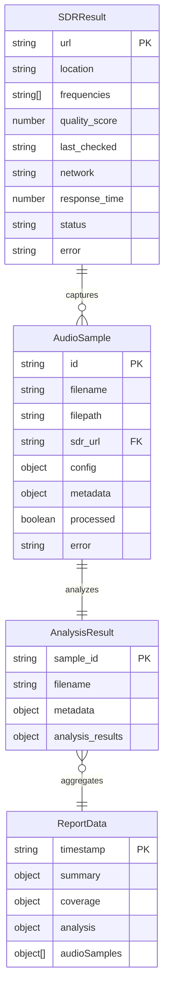

# 📊 Shortwave Monitor Data Models

## Data Model Architecture

The Shortwave Monitor system uses a structured data model hierarchy that flows through the SPARC phases: SDR Discovery → Audio Capture → Audio Analysis → Report Generation. This document defines all data schemas, relationships, and transformations.

## 🏗️ Data Model Hierarchy



## 📡 SDR Discovery Data Models

### SDRResult

Primary data structure for discovered SDR receivers.

```typescript
interface SDRResult {
  url: string;                    // Primary key - SDR web interface URL
  location: string;               // Geographic location description
  frequencies: string[];          // Available frequency bands
  quality_score: number;          // Quality score (0-100)
  last_checked: string;           // ISO8601 timestamp
  network: 'WebSDR' | 'KiwiSDR' | 'OpenWebRX';
  response_time?: number;         // Response time in milliseconds
  status?: 'online' | 'offline';  // Current status
  error?: string;                 // Error message if failed
}
```

#### Example Data
```json
{
  "url": "http://websdr.ewi.utwente.nl:8901/",
  "location": "University of Twente, Netherlands",
  "frequencies": ["80m", "40m", "20m", "15m", "10m"],
  "quality_score": 95,
  "last_checked": "2024-06-14T10:30:00.000Z",
  "network": "WebSDR",
  "response_time": 850,
  "status": "online"
}
```

### SDRDiscoveryMemory

Memory storage format for SDR discovery results.

```typescript
interface SDRDiscoveryMemory {
  active_sdrs: SDRResult[];
  sdr_ready: {
    count: number;
    timestamp: string;
  };
}
```

## 🎵 Audio Capture Data Models

### AudioSample

Core data structure for captured audio samples.

```typescript
interface AudioSample {
  id: string;                     // Unique identifier
  filename: string;               // Audio file name
  filepath: string;               // Full file path
  processed_filepath?: string;    // Path to processed audio file
  sdr: SDRResult;                // Source SDR information
  config: AudioCaptureConfig;    // Capture configuration
  metadata: AudioMetadata;       // Audio metadata
  processed: boolean;            // Processing status
  error?: string;                // Error message if failed
}
```

### AudioCaptureConfig

Configuration parameters for audio capture.

```typescript
interface AudioCaptureConfig {
  frequency: number;              // Center frequency in Hz
  bandwidth: number;              // Bandwidth in Hz
  mode: 'usb' | 'am' | 'cw';     // Demodulation mode
  type: 'hf_voice' | 'broadcast' | 'cw_digital' | 'utility';
  description: string;            // Human-readable description
}
```

### AudioMetadata

Metadata associated with captured audio.

```typescript
interface AudioMetadata {
  frequency: number;              // Capture frequency
  mode: string;                   // Demodulation mode
  bandwidth: number;              // Audio bandwidth
  duration: number;               // Duration in seconds
  sampleRate: number;             // Sample rate in Hz
  timestamp: string;              // Capture timestamp (ISO8601)
  quality_estimate: number;       // Estimated quality (0-100)
}
```

#### Example Data
```json
{
  "id": "websdr_hf_voice_2024061410",
  "filename": "hf_voice_netherlands_2024-06-14T10-30-00.wav",
  "filepath": "/data/audio/hf_voice_netherlands_2024-06-14T10-30-00.wav",
  "processed_filepath": "/data/audio/hf_voice_netherlands_2024-06-14T10-30-00_processed.wav",
  "sdr": {
    "url": "http://websdr.ewi.utwente.nl:8901/",
    "location": "University of Twente, Netherlands"
  },
  "config": {
    "frequency": 14250000,
    "bandwidth": 3000,
    "mode": "usb",
    "type": "hf_voice",
    "description": "Amateur radio voice communications"
  },
  "metadata": {
    "frequency": 14250000,
    "mode": "usb",
    "bandwidth": 3000,
    "duration": 60,
    "sampleRate": 16000,
    "timestamp": "2024-06-14T10:30:00.000Z",
    "quality_estimate": 85
  },
  "processed": true
}
```

## 🔬 Audio Analysis Data Models

### AnalysisResult

Complete analysis result for an audio sample.

```typescript
interface AnalysisResult {
  sample_id: string;              // References AudioSample.id
  filename: string;               // Original filename
  metadata: AudioMetadata;        // Original audio metadata
  analysis_results: AnalysisData; // Analysis findings
}
```

### AnalysisData

Detailed analysis findings from audio processing.

```typescript
interface AnalysisData {
  content_type: ContentType;      // Classified content type
  language: string;               // Detected language or 'unknown'
  transcription: string;          // Text transcription
  stations: string[];             // Identified stations/callsigns
  quality_score: number;          // Analysis quality (0-100)
  timestamp: string;              // Analysis timestamp (ISO8601)
  confidence: number;             // Confidence level (0-100)
  error?: string;                 // Error message if analysis failed
}
```

### ContentType

Enumeration of possible content types.

```typescript
type ContentType = 
  | 'voice'           // Voice communications
  | 'cw'              // Morse code (CW)
  | 'digital'         // Digital modes (PSK31, FT8, etc.)
  | 'broadcast'       // Broadcast transmissions
  | 'noise'           // Background noise/interference
  | 'utility'         // Utility stations
  | 'unknown';        // Unclassified content
```

#### Example Data
```json
{
  "sample_id": "websdr_hf_voice_2024061410",
  "filename": "hf_voice_netherlands_2024-06-14T10-30-00.wav",
  "metadata": {
    "frequency": 14250000,
    "duration": 60,
    "quality_estimate": 85
  },
  "analysis_results": {
    "content_type": "voice",
    "language": "english",
    "transcription": "CQ CQ CQ de W1ABC W1ABC K",
    "stations": ["W1ABC"],
    "quality_score": 85,
    "timestamp": "2024-06-14T10:32:15.000Z",
    "confidence": 88
  }
}
```

## 📊 Report Generation Data Models

### ReportData

Comprehensive data structure for dashboard generation.

```typescript
interface ReportData {
  timestamp: string;              // Report generation timestamp
  activeSDRs: SDRResult[];        // All discovered SDRs
  audioSamples: AudioSample[];    // All captured audio samples
  analysisResults: AnalysisResult[]; // All analysis results
  summary: ExecutiveSummary;      // Executive summary data
  coverage: CoverageData;         // Geographic coverage data
  analysis: AnalysisSummary;      // Analysis summary data
  audioSamples: PreparedAudioSample[]; // Dashboard-ready audio samples
}
```

### ExecutiveSummary

High-level summary statistics for the dashboard.

```typescript
interface ExecutiveSummary {
  totalSDRs: number;              // Number of discovered SDRs
  totalSamples: number;           // Number of captured samples
  totalAnalyses: number;          // Number of completed analyses
  keyFindings: string[];          // Key findings list
  notableActivity: NotableActivity[]; // Notable activities
  coverageAreas: string[];        // Geographic coverage areas
  detectedLanguages: string[];    // Languages detected
  stationCount: number;           // Unique stations identified
  qualityScore: number;           // Overall system quality score
}
```

### NotableActivity

Structure for highlighting significant activity.

```typescript
interface NotableActivity {
  type: ContentType;              // Type of activity
  confidence: number;             // Confidence level
  stations: string[];             // Associated stations
  language: string;               // Detected language
}
```

### CoverageData

Geographic coverage analysis data.

```typescript
interface CoverageData {
  totalLocations: number;         // Total SDR locations
  regions: Record<string, SDRResult[]>; // SDRs by region
  networkDistribution: Record<string, number>; // SDRs by network type
  qualityDistribution: Record<string, number>; // SDRs by quality band
}
```

### AnalysisSummary

Summary of analysis results for dashboard charts.

```typescript
interface AnalysisSummary {
  contentTypes: Record<string, number>; // Content type distribution
  languages: Record<string, number>;    // Language distribution
  averageConfidence: number;            // Average confidence score
  stationsByType: Record<string, string[]>; // Stations grouped by type
  trends: any[];                        // Trend analysis data
}
```

### PreparedAudioSample

Dashboard-optimized audio sample data.

```typescript
interface PreparedAudioSample {
  id: string;                     // Sample identifier
  filename: string;               // Original filename
  sdr: string;                    // SDR location name
  frequency: number;              // Capture frequency
  type: string;                   // Sample type
  duration: number;               // Duration in seconds
  quality: number;                // Quality score
  analysis: AnalysisData | null;  // Associated analysis
  playable: boolean;              // Whether audio is playable
}
```

## 🗄️ Memory Storage Models

### MemoryEntry

Base structure for memory storage.

```typescript
interface MemoryEntry<T = any> {
  key: string;                    // Memory key
  data: T;                        // Stored data
  timestamp: string;              // Storage timestamp (ISO8601)
  namespace: string;              // Memory namespace
}
```

### Memory Signals

Predefined signal structures for agent coordination.

```typescript
interface MemorySignals {
  sparc_start: {
    timestamp: string;
    orchestrator: 'active';
    phase: 'initialization';
  };
  
  sdr_ready: {
    count: number;
    timestamp: string;
  };
  
  capture_complete: {
    count: number;
    timestamp: string;
  };
  
  analysis_complete: {
    count: number;
    timestamp: string;
  };
  
  report_ready: {
    url: string;
    timestamp: string;
    summary: ExecutiveSummary;
  };
  
  mission_complete: {
    status: 'success';
    timestamp: string;
    execution_time: number;
    summary: {
      sdrs_discovered: number;
      samples_captured: number;
      analyses_completed: number;
      report_generated: boolean;
    };
  };
}
```

## 🔄 Data Transformations

### SDR Discovery → Audio Capture

```typescript
// Transform SDR results for audio capture
function prepareSDRsForCapture(sdrs: SDRResult[]): SDRResult[] {
  return sdrs
    .filter(sdr => sdr.quality_score > 30)
    .sort((a, b) => b.quality_score - a.quality_score)
    .slice(0, 5); // Top 5 SDRs
}
```

### Audio Capture → Analysis

```typescript
// Transform audio samples for analysis
function prepareAudioForAnalysis(samples: AudioSample[]): AudioSample[] {
  return samples.filter(sample => sample.processed === true);
}
```

### Analysis → Report

```typescript
// Aggregate analysis results for reporting
function aggregateAnalysisResults(results: AnalysisResult[]): AnalysisSummary {
  const contentTypes: Record<string, number> = {};
  const languages: Record<string, number> = {};
  
  results.forEach(result => {
    const { content_type, language } = result.analysis_results;
    contentTypes[content_type] = (contentTypes[content_type] || 0) + 1;
    if (language !== 'unknown') {
      languages[language] = (languages[language] || 0) + 1;
    }
  });
  
  return {
    contentTypes,
    languages,
    averageConfidence: calculateAverageConfidence(results),
    stationsByType: groupStationsByType(results),
    trends: []
  };
}
```

## 📏 Data Validation

### Validation Schemas

```typescript
// SDR validation
function validateSDRResult(sdr: any): sdr is SDRResult {
  return typeof sdr.url === 'string' &&
         typeof sdr.location === 'string' &&
         Array.isArray(sdr.frequencies) &&
         typeof sdr.quality_score === 'number' &&
         sdr.quality_score >= 0 && sdr.quality_score <= 100;
}

// Audio sample validation
function validateAudioSample(sample: any): sample is AudioSample {
  return typeof sample.id === 'string' &&
         typeof sample.filename === 'string' &&
         typeof sample.filepath === 'string' &&
         validateSDRResult(sample.sdr) &&
         validateAudioCaptureConfig(sample.config);
}

// Analysis result validation
function validateAnalysisResult(result: any): result is AnalysisResult {
  return typeof result.sample_id === 'string' &&
         typeof result.filename === 'string' &&
         validateAnalysisData(result.analysis_results);
}
```

## 📊 Data Persistence

### File Storage Structure

```
data/
├── audio/                      # Audio files
│   ├── *.wav                  # Original audio samples
│   └── *_processed.wav        # Processed audio files
├── analysis/                  # Analysis results
│   └── *_analysis.json        # Individual analysis files
├── memory/                    # Memory storage
│   ├── shortwave_monitor_*.json # Memory entries
│   └── signals/               # Signal files
└── reports/                   # Generated reports
    └── dashboard.html         # Dashboard file
```

### Memory File Format

```json
{
  "key": "active_sdrs",
  "data": [
    {
      "url": "http://websdr.example.com/",
      "location": "Example Location",
      "quality_score": 85
    }
  ],
  "timestamp": "2024-06-14T10:30:00.000Z",
  "namespace": "shortwave_monitor"
}
```

This data model specification provides a complete foundation for understanding how data flows through the Shortwave Monitor system, ensuring consistency and enabling efficient processing across all SPARC phases.