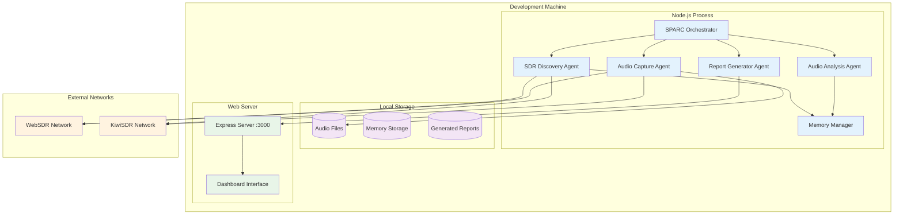
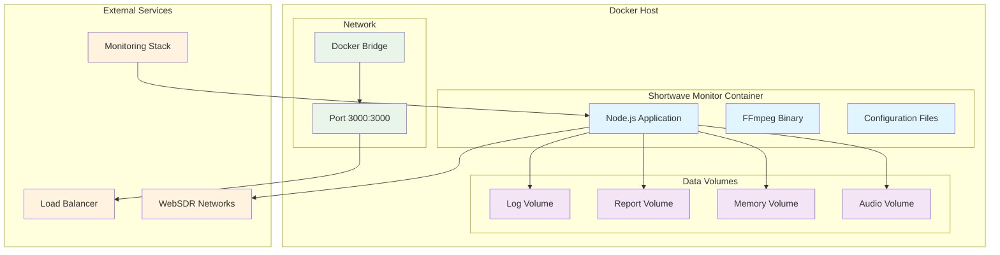
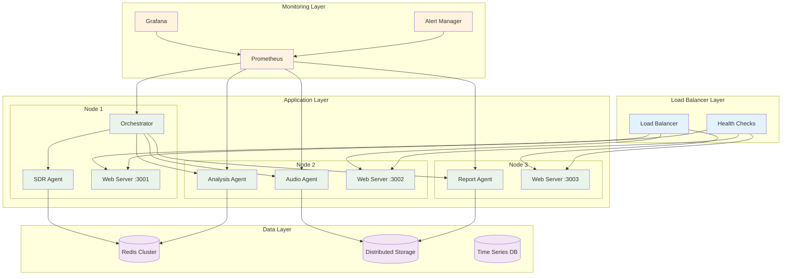
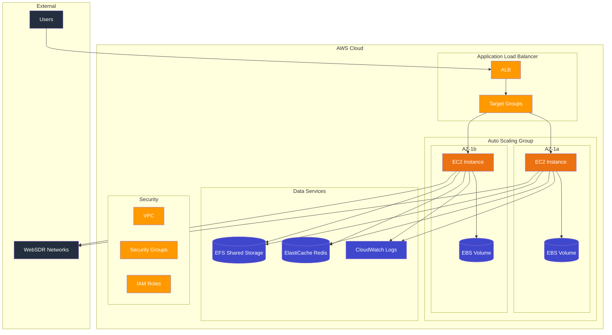

# 🚀 Shortwave Monitor Deployment Architecture

## Deployment Overview

The Shortwave Monitor system supports multiple deployment patterns, from local development to production-scale distributed deployments. This document outlines infrastructure architecture, deployment strategies, and operational considerations.

## 🏗️ Deployment Architecture Patterns

### 1. Single-Node Development Deployment



### 2. Containerized Production Deployment



### 3. Distributed Multi-Node Deployment



## 🐳 Container Architecture

### Dockerfile

```dockerfile
# Multi-stage build for optimized production image
FROM node:18-alpine AS builder

WORKDIR /app

# Install build dependencies
RUN apk add --no-cache python3 make g++

# Copy package files
COPY package*.json ./

# Install dependencies
RUN npm ci --only=production && npm cache clean --force

# Copy application code
COPY . .

# Build application (if needed)
RUN npm run build

# Production stage
FROM node:18-alpine AS production

# Install runtime dependencies
RUN apk add --no-cache \
    ffmpeg \
    curl \
    tini

# Create non-root user
RUN addgroup -g 1001 -S nodejs && \
    adduser -S nextjs -u 1001

# Set working directory
WORKDIR /app

# Copy built application
COPY --from=builder --chown=nextjs:nodejs /app .

# Create data directories
RUN mkdir -p data/{audio,analysis,memory,reports} && \
    chown -R nextjs:nodejs data

# Switch to non-root user
USER nextjs

# Expose port
EXPOSE 3000

# Health check
HEALTHCHECK --interval=30s --timeout=10s --start-period=5s --retries=3 \
    CMD curl -f http://localhost:3000/api/health || exit 1

# Use tini as init system
ENTRYPOINT ["/sbin/tini", "--"]

# Start application
CMD ["npm", "start"]
```

### Docker Compose Configuration

```yaml
version: '3.8'

services:
  shortwave-monitor:
    build:
      context: .
      dockerfile: Dockerfile
    ports:
      - "3000:3000"
    volumes:
      - audio-data:/app/data/audio
      - memory-data:/app/data/memory
      - report-data:/app/data/reports
      - logs:/app/logs
    environment:
      - NODE_ENV=production
      - PORT=3000
      - LOG_LEVEL=info
      - AUDIO_SAMPLE_RATE=16000
      - CAPTURE_DURATION=60
    restart: unless-stopped
    healthcheck:
      test: ["CMD", "curl", "-f", "http://localhost:3000/api/health"]
      interval: 30s
      timeout: 10s
      retries: 3
      start_period: 60s
    security_opt:
      - no-new-privileges:true
    read_only: true
    tmpfs:
      - /tmp:noexec,nosuid,size=100m
    networks:
      - shortwave-net

  # Optional: Redis for distributed memory management
  redis:
    image: redis:7-alpine
    command: redis-server --appendonly yes
    volumes:
      - redis-data:/data
    restart: unless-stopped
    networks:
      - shortwave-net

  # Optional: Monitoring stack
  prometheus:
    image: prom/prometheus:latest
    ports:
      - "9090:9090"
    volumes:
      - ./monitoring/prometheus.yml:/etc/prometheus/prometheus.yml
      - prometheus-data:/prometheus
    restart: unless-stopped
    networks:
      - shortwave-net

  grafana:
    image: grafana/grafana:latest
    ports:
      - "3001:3000"
    volumes:
      - grafana-data:/var/lib/grafana
      - ./monitoring/grafana/dashboards:/etc/grafana/provisioning/dashboards
    environment:
      - GF_SECURITY_ADMIN_PASSWORD=admin
    restart: unless-stopped
    networks:
      - shortwave-net

volumes:
  audio-data:
    driver: local
  memory-data:
    driver: local
  report-data:
    driver: local
  logs:
    driver: local
  redis-data:
    driver: local
  prometheus-data:
    driver: local
  grafana-data:
    driver: local

networks:
  shortwave-net:
    driver: bridge
```

## ☁️ Cloud Deployment Architectures

### AWS Deployment



#### AWS CloudFormation Template (Key Resources)

```yaml
AWSTemplateFormatVersion: '2010-09-09'
Description: 'Shortwave Monitor Infrastructure'

Parameters:
  InstanceType:
    Type: String
    Default: t3.medium
    Description: EC2 instance type
  
  KeyPairName:
    Type: AWS::EC2::KeyPair::KeyName
    Description: EC2 Key Pair for SSH access

Resources:
  # VPC and Networking
  VPC:
    Type: AWS::EC2::VPC
    Properties:
      CidrBlock: 10.0.0.0/16
      EnableDnsHostnames: true
      EnableDnsSupport: true
      Tags:
        - Key: Name
          Value: ShortwareMonitor-VPC

  PublicSubnet1:
    Type: AWS::EC2::Subnet
    Properties:
      VpcId: !Ref VPC
      CidrBlock: 10.0.1.0/24
      AvailabilityZone: !Select [0, !GetAZs '']
      MapPublicIpOnLaunch: true

  PublicSubnet2:
    Type: AWS::EC2::Subnet
    Properties:
      VpcId: !Ref VPC
      CidrBlock: 10.0.2.0/24
      AvailabilityZone: !Select [1, !GetAZs '']
      MapPublicIpOnLaunch: true

  # Security Groups
  ApplicationSecurityGroup:
    Type: AWS::EC2::SecurityGroup
    Properties:
      GroupDescription: Security group for Shortwave Monitor application
      VpcId: !Ref VPC
      SecurityGroupIngress:
        - IpProtocol: tcp
          FromPort: 3000
          ToPort: 3000
          SourceSecurityGroupId: !Ref LoadBalancerSecurityGroup
        - IpProtocol: tcp
          FromPort: 22
          ToPort: 22
          CidrIp: 0.0.0.0/0
      SecurityGroupEgress:
        - IpProtocol: -1
          CidrIp: 0.0.0.0/0

  LoadBalancerSecurityGroup:
    Type: AWS::EC2::SecurityGroup
    Properties:
      GroupDescription: Security group for Application Load Balancer
      VpcId: !Ref VPC
      SecurityGroupIngress:
        - IpProtocol: tcp
          FromPort: 80
          ToPort: 80
          CidrIp: 0.0.0.0/0
        - IpProtocol: tcp
          FromPort: 443
          ToPort: 443
          CidrIp: 0.0.0.0/0

  # Auto Scaling Group
  LaunchTemplate:
    Type: AWS::EC2::LaunchTemplate
    Properties:
      LaunchTemplateName: ShortwareMonitor-LaunchTemplate
      LaunchTemplateData:
        InstanceType: !Ref InstanceType
        KeyName: !Ref KeyPairName
        SecurityGroupIds:
          - !Ref ApplicationSecurityGroup
        ImageId: ami-0abcdef1234567890  # Amazon Linux 2 AMI
        UserData:
          Fn::Base64: !Sub |
            #!/bin/bash
            yum update -y
            yum install -y docker git
            service docker start
            usermod -a -G docker ec2-user
            
            # Install Docker Compose
            curl -L https://github.com/docker/compose/releases/latest/download/docker-compose-$(uname -s)-$(uname -m) -o /usr/local/bin/docker-compose
            chmod +x /usr/local/bin/docker-compose
            
            # Clone and start application
            git clone https://github.com/your-org/shortwave-monitor.git /opt/shortwave-monitor
            cd /opt/shortwave-monitor
            docker-compose up -d

  AutoScalingGroup:
    Type: AWS::AutoScaling::AutoScalingGroup
    Properties:
      VPCZoneIdentifier:
        - !Ref PublicSubnet1
        - !Ref PublicSubnet2
      LaunchTemplate:
        LaunchTemplateId: !Ref LaunchTemplate
        Version: !GetAtt LaunchTemplate.LatestVersionNumber
      MinSize: 1
      MaxSize: 3
      DesiredCapacity: 2
      TargetGroupARNs:
        - !Ref TargetGroup
      HealthCheckType: ELB
      HealthCheckGracePeriod: 300

  # Load Balancer
  LoadBalancer:
    Type: AWS::ElasticLoadBalancingV2::LoadBalancer
    Properties:
      Scheme: internet-facing
      Type: application
      SecurityGroups:
        - !Ref LoadBalancerSecurityGroup
      Subnets:
        - !Ref PublicSubnet1
        - !Ref PublicSubnet2

  TargetGroup:
    Type: AWS::ElasticLoadBalancingV2::TargetGroup
    Properties:
      Port: 3000
      Protocol: HTTP
      VpcId: !Ref VPC
      HealthCheckPath: /api/health
      HealthCheckIntervalSeconds: 30
      HealthyThresholdCount: 2
      UnhealthyThresholdCount: 5

  Listener:
    Type: AWS::ElasticLoadBalancingV2::Listener
    Properties:
      DefaultActions:
        - Type: forward
          TargetGroupArn: !Ref TargetGroup
      LoadBalancerArn: !Ref LoadBalancer
      Port: 80
      Protocol: HTTP

Outputs:
  LoadBalancerDNS:
    Description: DNS name of the load balancer
    Value: !GetAtt LoadBalancer.DNSName
```

## 🚀 Kubernetes Deployment

### Kubernetes Manifests

```yaml
# Namespace
apiVersion: v1
kind: Namespace
metadata:
  name: shortwave-monitor

---
# ConfigMap
apiVersion: v1
kind: ConfigMap
metadata:
  name: shortwave-config
  namespace: shortwave-monitor
data:
  NODE_ENV: "production"
  PORT: "3000"
  LOG_LEVEL: "info"
  AUDIO_SAMPLE_RATE: "16000"
  CAPTURE_DURATION: "60"

---
# Secret for sensitive data
apiVersion: v1
kind: Secret
metadata:
  name: shortwave-secrets
  namespace: shortwave-monitor
type: Opaque
data:
  session-secret: <base64-encoded-secret>

---
# Persistent Volume Claim
apiVersion: v1
kind: PersistentVolumeClaim
metadata:
  name: shortwave-data
  namespace: shortwave-monitor
spec:
  accessModes:
    - ReadWriteOnce
  resources:
    requests:
      storage: 10Gi
  storageClassName: gp2

---
# Deployment
apiVersion: apps/v1
kind: Deployment
metadata:
  name: shortwave-monitor
  namespace: shortwave-monitor
spec:
  replicas: 2
  selector:
    matchLabels:
      app: shortwave-monitor
  template:
    metadata:
      labels:
        app: shortwave-monitor
    spec:
      securityContext:
        fsGroup: 1001
      containers:
      - name: shortwave-monitor
        image: shortwave-monitor:latest
        ports:
        - containerPort: 3000
        envFrom:
        - configMapRef:
            name: shortwave-config
        - secretRef:
            name: shortwave-secrets
        volumeMounts:
        - name: data-volume
          mountPath: /app/data
        livenessProbe:
          httpGet:
            path: /api/health
            port: 3000
          initialDelaySeconds: 60
          periodSeconds: 30
        readinessProbe:
          httpGet:
            path: /api/health
            port: 3000
          initialDelaySeconds: 30
          periodSeconds: 10
        resources:
          requests:
            memory: "512Mi"
            cpu: "250m"
          limits:
            memory: "1Gi"
            cpu: "500m"
        securityContext:
          runAsNonRoot: true
          runAsUser: 1001
          allowPrivilegeEscalation: false
          readOnlyRootFilesystem: true
          capabilities:
            drop:
            - ALL
      volumes:
      - name: data-volume
        persistentVolumeClaim:
          claimName: shortwave-data

---
# Service
apiVersion: v1
kind: Service
metadata:
  name: shortwave-service
  namespace: shortwave-monitor
spec:
  selector:
    app: shortwave-monitor
  ports:
  - port: 80
    targetPort: 3000
  type: ClusterIP

---
# Ingress
apiVersion: networking.k8s.io/v1
kind: Ingress
metadata:
  name: shortwave-ingress
  namespace: shortwave-monitor
  annotations:
    kubernetes.io/ingress.class: "nginx"
    cert-manager.io/cluster-issuer: "letsencrypt-prod"
    nginx.ingress.kubernetes.io/rate-limit: "100"
spec:
  tls:
  - hosts:
    - shortwave.example.com
    secretName: shortwave-tls
  rules:
  - host: shortwave.example.com
    http:
      paths:
      - path: /
        pathType: Prefix
        backend:
          service:
            name: shortwave-service
            port:
              number: 80

---
# HorizontalPodAutoscaler
apiVersion: autoscaling/v2
kind: HorizontalPodAutoscaler
metadata:
  name: shortwave-hpa
  namespace: shortwave-monitor
spec:
  scaleTargetRef:
    apiVersion: apps/v1
    kind: Deployment
    name: shortwave-monitor
  minReplicas: 2
  maxReplicas: 10
  metrics:
  - type: Resource
    resource:
      name: cpu
      target:
        type: Utilization
        averageUtilization: 70
  - type: Resource
    resource:
      name: memory
      target:
        type: Utilization
        averageUtilization: 80
```

## 📊 Monitoring & Observability

### Prometheus Configuration

```yaml
# prometheus.yml
global:
  scrape_interval: 15s
  evaluation_interval: 15s

rule_files:
  - "shortwave-monitor.rules.yml"

scrape_configs:
  - job_name: 'shortwave-monitor'
    static_configs:
      - targets: ['shortwave-monitor:3000']
    metrics_path: '/metrics'
    scrape_interval: 30s

  - job_name: 'node-exporter'
    static_configs:
      - targets: ['node-exporter:9100']

alerting:
  alertmanagers:
    - static_configs:
        - targets:
          - alertmanager:9093
```

### Grafana Dashboard Configuration

```json
{
  "dashboard": {
    "title": "Shortwave Monitor Dashboard",
    "panels": [
      {
        "title": "SDR Discovery Rate",
        "type": "graph",
        "targets": [
          {
            "expr": "rate(shortwave_sdr_discoveries_total[5m])",
            "legendFormat": "SDRs/sec"
          }
        ]
      },
      {
        "title": "Audio Capture Success Rate",
        "type": "stat",
        "targets": [
          {
            "expr": "rate(shortwave_audio_captures_success[5m]) / rate(shortwave_audio_captures_total[5m])",
            "legendFormat": "Success Rate"
          }
        ]
      },
      {
        "title": "Analysis Processing Time",
        "type": "histogram",
        "targets": [
          {
            "expr": "histogram_quantile(0.95, rate(shortwave_analysis_duration_seconds_bucket[5m]))",
            "legendFormat": "95th percentile"
          }
        ]
      }
    ]
  }
}
```

## 🔧 Environment Configuration

### Production Environment Variables

```bash
# Application Configuration
NODE_ENV=production
PORT=3000
LOG_LEVEL=warn

# Audio Processing
AUDIO_SAMPLE_RATE=16000
CAPTURE_DURATION=60
MAX_CONCURRENT_CAPTURES=5

# Memory Management
MEMORY_CLEANUP_INTERVAL=3600000  # 1 hour
MAX_MEMORY_ENTRIES=1000

# Network Configuration
REQUEST_TIMEOUT=10000
MAX_RESPONSE_SIZE=10485760  # 10MB
RATE_LIMIT_REQUESTS=100
RATE_LIMIT_WINDOW=60000  # 1 minute

# Security
SESSION_SECRET=${RANDOM_SECRET}
SECURE_COOKIES=true
HTTPS_ONLY=true

# Monitoring
METRICS_ENABLED=true
HEALTH_CHECK_INTERVAL=30000
```

### Health Check Implementation

```typescript
interface HealthStatus {
  status: 'healthy' | 'unhealthy' | 'degraded';
  timestamp: string;
  uptime: number;
  memory: NodeJS.MemoryUsage;
  agents: Record<string, 'active' | 'idle' | 'error'>;
  external: {
    sdr_networks: 'accessible' | 'limited' | 'unavailable';
  };
}

class HealthChecker {
  async checkHealth(): Promise<HealthStatus> {
    const status: HealthStatus = {
      status: 'healthy',
      timestamp: new Date().toISOString(),
      uptime: process.uptime(),
      memory: process.memoryUsage(),
      agents: {
        sdr_discovery: 'idle',
        audio_capture: 'idle', 
        audio_analysis: 'idle',
        report_generator: 'idle'
      },
      external: {
        sdr_networks: 'accessible'
      }
    };

    // Check agent status
    const agentChecks = await this.checkAgentHealth();
    status.agents = agentChecks;
    
    // Check external connectivity
    const externalChecks = await this.checkExternalHealth();
    status.external = externalChecks;
    
    // Determine overall status
    const hasErrors = Object.values(status.agents).includes('error');
    const hasLimitedExternal = status.external.sdr_networks === 'limited';
    
    if (hasErrors) {
      status.status = 'unhealthy';
    } else if (hasLimitedExternal) {
      status.status = 'degraded';
    }
    
    return status;
  }
  
  private async checkAgentHealth(): Promise<Record<string, string>> {
    // Implementation to check each agent's health
    return {
      sdr_discovery: 'active',
      audio_capture: 'idle',
      audio_analysis: 'idle', 
      report_generator: 'idle'
    };
  }
  
  private async checkExternalHealth(): Promise<any> {
    // Test connectivity to key SDR networks
    try {
      await Promise.race([
        fetch('http://websdr.org/', { timeout: 5000 }),
        fetch('http://kiwisdr.com/', { timeout: 5000 })
      ]);
      return { sdr_networks: 'accessible' };
    } catch {
      return { sdr_networks: 'limited' };
    }
  }
}
```

This deployment architecture provides comprehensive guidance for deploying the Shortwave Monitor system across various environments, from development to production-scale distributed deployments.