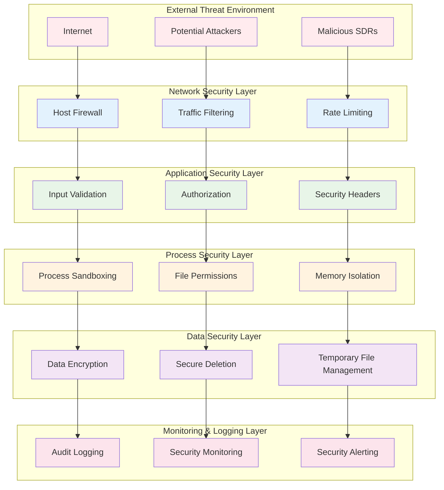
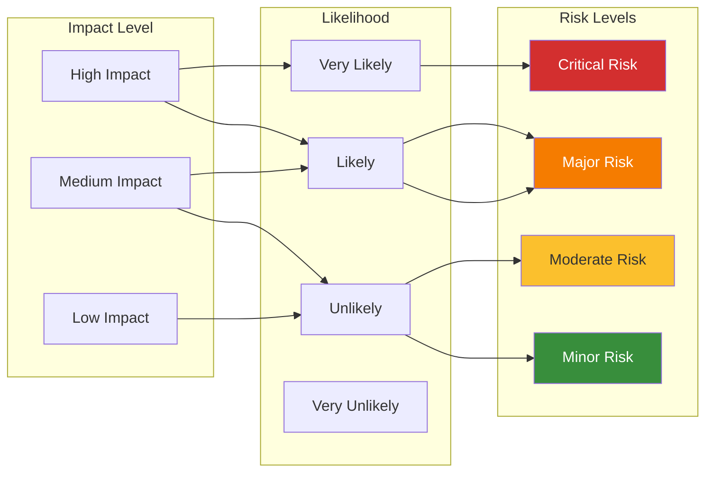
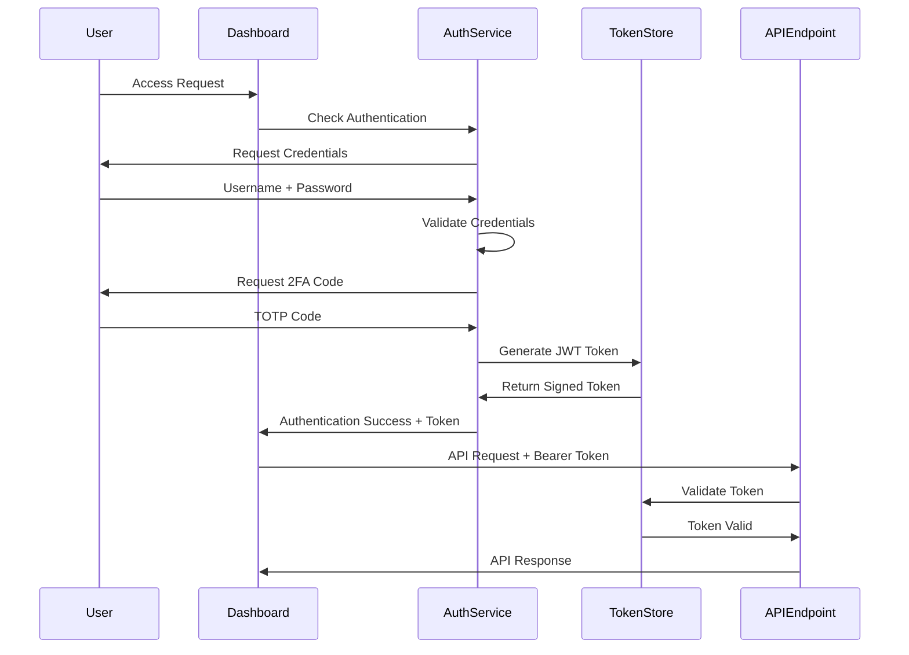

# 🔐 Shortwave Monitor Security Architecture

## Security Overview

The Shortwave Monitor system implements a multi-layered security architecture designed to protect against threats while maintaining operational effectiveness. This document outlines security boundaries, threat models, authentication flows, and privacy safeguards.

## 🛡️ Security Principles

### Core Security Tenets
1. **Defense in Depth**: Multiple security layers protect against various threat vectors
2. **Principle of Least Privilege**: Components operate with minimal required permissions
3. **Privacy by Design**: No personal information collection or storage
4. **Local Processing**: All sensitive operations performed locally, no cloud dependencies
5. **Transparent Operations**: Open source approach allows security auditing

## 🏗️ Security Architecture Layers



## 🚨 Threat Model

### Identified Threats

#### 1. Network-Based Threats
- **Malicious SDR Endpoints**: Compromised or honeypot SDR servers
- **Man-in-the-Middle Attacks**: Traffic interception during SDR communication
- **DDoS Attacks**: Overwhelming system with discovery requests
- **DNS Poisoning**: Redirecting SDR discovery to malicious servers

#### 2. Application-Level Threats  
- **Code Injection**: Malicious data in SDR responses
- **Buffer Overflows**: Memory corruption in audio processing
- **Path Traversal**: Unauthorized file system access
- **Cross-Site Scripting (XSS)**: Malicious scripts in dashboard

#### 3. Data Security Threats
- **Audio Data Interception**: Unauthorized access to captured audio
- **Memory Dump Attacks**: Extracting sensitive data from memory
- **File System Attacks**: Unauthorized access to stored data
- **Side-Channel Attacks**: Information leakage through timing/power analysis

#### 4. System-Level Threats
- **Privilege Escalation**: Gaining unauthorized system access
- **Resource Exhaustion**: DoS through resource consumption
- **Supply Chain Attacks**: Compromised dependencies
- **Physical Access**: Direct system compromise

### Threat Severity Matrix



## 🔒 Authentication & Authorization

### Current Security Model

#### Localhost-Only Access
```yaml
Current Security Model:
  - Authentication: None (localhost trusted)
  - Authorization: File system permissions only
  - Network Access: Localhost binding only
  - Data Protection: OS-level file permissions
```

### Enhanced Security Model (Roadmap)

#### Multi-Factor Authentication Flow


#### Role-Based Access Control
```typescript
interface UserRole {
  id: string;
  name: 'admin' | 'operator' | 'viewer';
  permissions: Permission[];
}

interface Permission {
  resource: 'sdr' | 'audio' | 'analysis' | 'reports' | 'config';
  actions: ('read' | 'write' | 'delete' | 'execute')[];
}

// Example role definitions
const roles: UserRole[] = [
  {
    id: 'admin',
    name: 'admin',
    permissions: [
      { resource: '*', actions: ['read', 'write', 'delete', 'execute'] }
    ]
  },
  {
    id: 'operator', 
    name: 'operator',
    permissions: [
      { resource: 'sdr', actions: ['read', 'execute'] },
      { resource: 'audio', actions: ['read', 'write'] },
      { resource: 'analysis', actions: ['read', 'execute'] },
      { resource: 'reports', actions: ['read', 'write'] }
    ]
  },
  {
    id: 'viewer',
    name: 'viewer', 
    permissions: [
      { resource: 'reports', actions: ['read'] },
      { resource: 'audio', actions: ['read'] }
    ]
  }
];
```

## 🛡️ Network Security

### Network Architecture
```yaml
Network Security Controls:
  Binding:
    - Interface: localhost (127.0.0.1) only
    - Port: 3000 (configurable)
    - Protocol: HTTP (HTTPS in production)
  
  Outbound Connections:
    - WebSDR Networks: HTTP/HTTPS only
    - Rate Limited: 5 requests/second per endpoint
    - Timeout: 10 seconds maximum
    - User Agent: "Shortwave-Monitor/1.0"
  
  Input Validation:
    - URL Validation: Strict HTTP/HTTPS URL parsing
    - Content-Type Checking: Expected MIME types only
    - Size Limits: 10MB maximum response size
    - Character Encoding: UTF-8 validation
```

### Network Security Implementation
```typescript
// Secure HTTP client configuration
const secureHttpConfig = {
  timeout: 10000,
  maxResponseSize: 10 * 1024 * 1024, // 10MB
  allowedProtocols: ['http:', 'https:'],
  userAgent: 'Shortwave-Monitor/1.0',
  headers: {
    'Accept': 'text/html,application/json',
    'Accept-Encoding': 'gzip, deflate',
    'Cache-Control': 'no-cache'
  }
};

// Rate limiting implementation
class RateLimiter {
  private requests: Map<string, number[]> = new Map();
  private readonly maxRequests = 5;
  private readonly windowMs = 1000;

  isAllowed(endpoint: string): boolean {
    const now = Date.now();
    const requests = this.requests.get(endpoint) || [];
    
    // Remove old requests outside window
    const validRequests = requests.filter(
      time => now - time < this.windowMs
    );
    
    if (validRequests.length >= this.maxRequests) {
      return false;
    }
    
    validRequests.push(now);
    this.requests.set(endpoint, validRequests);
    return true;
  }
}
```

## 🔐 Data Security

### Data Classification
```yaml
Data Classification:
  Public:
    - SDR URLs and locations
    - Frequency information
    - System status information
  
  Internal:
    - Audio sample metadata
    - Analysis configurations
    - Performance metrics
  
  Restricted:
    - Captured audio content (temporary)
    - Detailed analysis results
    - System logs with sensitive data
  
  Confidential:
    - Authentication tokens (future)
    - Encryption keys (future)
    - Personal information (not collected)
```

### Data Protection Controls

#### Encryption at Rest
```typescript
// File encryption for sensitive data (future enhancement)
class DataEncryption {
  private readonly algorithm = 'aes-256-gcm';
  private readonly keyLength = 32;
  
  async encryptFile(filePath: string, key: Buffer): Promise<void> {
    const iv = crypto.randomBytes(16);
    const cipher = crypto.createCipher(this.algorithm, key);
    
    const input = fs.createReadStream(filePath);
    const output = fs.createWriteStream(`${filePath}.encrypted`);
    
    return new Promise((resolve, reject) => {
      pipeline([
        input,
        cipher,
        output
      ], (error) => {
        if (error) reject(error);
        else resolve();
      });
    });
  }
  
  async decryptFile(filePath: string, key: Buffer): Promise<void> {
    const decipher = crypto.createDecipher(this.algorithm, key);
    
    const input = fs.createReadStream(filePath);
    const output = fs.createWriteStream(filePath.replace('.encrypted', ''));
    
    return new Promise((resolve, reject) => {
      pipeline([
        input,
        decipher,
        output
      ], (error) => {
        if (error) reject(error);
        else resolve();
      });
    });
  }
}
```

#### Secure Data Deletion
```typescript
class SecureDataManager {
  async secureDelete(filePath: string): Promise<void> {
    try {
      // Multiple-pass overwrite for sensitive data
      const fileSize = (await fs.stat(filePath)).size;
      const fd = await fs.open(filePath, 'r+');
      
      // Pass 1: Random data
      const randomBuffer = crypto.randomBytes(fileSize);
      await fd.write(randomBuffer, 0, fileSize, 0);
      await fd.sync();
      
      // Pass 2: All zeros
      const zeroBuffer = Buffer.alloc(fileSize, 0);
      await fd.write(zeroBuffer, 0, fileSize, 0);
      await fd.sync();
      
      // Pass 3: All ones
      const oneBuffer = Buffer.alloc(fileSize, 0xFF);
      await fd.write(oneBuffer, 0, fileSize, 0);
      await fd.sync();
      
      await fd.close();
      await fs.unlink(filePath);
      
    } catch (error) {
      console.error('Secure deletion failed:', error);
      // Fallback to standard deletion
      await fs.unlink(filePath).catch(() => {});
    }
  }
  
  async cleanupTemporaryFiles(): Promise<void> {
    const tempDir = path.join(process.cwd(), 'data', 'temp');
    const files = await fs.readdir(tempDir).catch(() => []);
    
    for (const file of files) {
      const filePath = path.join(tempDir, file);
      const stats = await fs.stat(filePath).catch(() => null);
      
      if (stats && Date.now() - stats.mtime.getTime() > 3600000) { // 1 hour
        await this.secureDelete(filePath);
      }
    }
  }
}
```

## 🔍 Input Validation & Sanitization

### URL Validation
```typescript
class URLValidator {
  private allowedProtocols = ['http:', 'https:'];
  private blockedHosts = ['localhost', '127.0.0.1', '0.0.0.0'];
  
  validateSDRUrl(urlString: string): boolean {
    try {
      const url = new URL(urlString);
      
      // Protocol check
      if (!this.allowedProtocols.includes(url.protocol)) {
        return false;
      }
      
      // Host check (prevent internal network access)
      if (this.blockedHosts.includes(url.hostname)) {
        return false;
      }
      
      // Private IP range check
      if (this.isPrivateIP(url.hostname)) {
        return false;
      }
      
      // Port check (common web ports only)
      const port = url.port ? parseInt(url.port) : (url.protocol === 'https:' ? 443 : 80);
      if (port < 80 || port > 65535 || this.isBlockedPort(port)) {
        return false;
      }
      
      return true;
    } catch {
      return false;
    }
  }
  
  private isPrivateIP(hostname: string): boolean {
    const privateRanges = [
      /^10\./,
      /^172\.(1[6-9]|2[0-9]|3[0-1])\./,
      /^192\.168\./,
      /^169\.254\./, // Link-local
      /^::1$/, // IPv6 localhost
      /^fc00:/, // IPv6 private
    ];
    
    return privateRanges.some(range => range.test(hostname));
  }
  
  private isBlockedPort(port: number): boolean {
    const blockedPorts = [22, 23, 25, 53, 135, 139, 445, 1433, 3389];
    return blockedPorts.includes(port);
  }
}
```

### Content Sanitization
```typescript
class ContentSanitizer {
  sanitizeHTML(html: string): string {
    // Remove script tags and dangerous attributes
    return html
      .replace(/<script\b[^<]*(?:(?!<\/script>)<[^<]*)*<\/script>/gi, '')
      .replace(/on\w+="[^"]*"/gi, '')
      .replace(/javascript:/gi, '')
      .replace(/data:(?!image\/)/gi, '');
  }
  
  sanitizeFilename(filename: string): string {
    // Remove path traversal and dangerous characters
    return filename
      .replace(/[<>:"/\\|?*]/g, '')
      .replace(/\.\./g, '')
      .substring(0, 255);
  }
  
  sanitizeAudioData(buffer: Buffer): Buffer {
    // Validate audio file headers
    const wavHeader = buffer.slice(0, 12);
    if (!this.isValidWavHeader(wavHeader)) {
      throw new Error('Invalid audio file format');
    }
    
    return buffer;
  }
  
  private isValidWavHeader(header: Buffer): boolean {
    return header.slice(0, 4).toString() === 'RIFF' &&
           header.slice(8, 12).toString() === 'WAVE';
  }
}
```

## 🚨 Security Monitoring & Incident Response

### Security Event Detection
```typescript
interface SecurityEvent {
  id: string;
  timestamp: string;
  type: 'authentication' | 'authorization' | 'network' | 'data' | 'system';
  severity: 'low' | 'medium' | 'high' | 'critical';
  source: string;
  description: string;
  metadata: Record<string, any>;
}

class SecurityMonitor {
  private events: SecurityEvent[] = [];
  private readonly maxEvents = 1000;
  
  logSecurityEvent(event: Omit<SecurityEvent, 'id' | 'timestamp'>): void {
    const securityEvent: SecurityEvent = {
      id: crypto.randomUUID(),
      timestamp: new Date().toISOString(),
      ...event
    };
    
    this.events.push(securityEvent);
    
    // Maintain event buffer size
    if (this.events.length > this.maxEvents) {
      this.events.shift();
    }
    
    // Alert on critical events
    if (event.severity === 'critical') {
      this.triggerAlert(securityEvent);
    }
    
    console.log(`[SECURITY] ${event.severity.toUpperCase()}: ${event.description}`);
  }
  
  private triggerAlert(event: SecurityEvent): void {
    // In production, this would integrate with alerting systems
    console.error(`SECURITY ALERT: ${event.description}`, event);
  }
  
  getSecurityEvents(filter?: Partial<SecurityEvent>): SecurityEvent[] {
    if (!filter) return this.events;
    
    return this.events.filter(event => {
      return Object.entries(filter).every(([key, value]) => 
        event[key as keyof SecurityEvent] === value
      );
    });
  }
}
```

### Incident Response Procedures

#### Automated Response Actions
```typescript
class IncidentResponse {
  async handleSecurityIncident(event: SecurityEvent): Promise<void> {
    switch (event.type) {
      case 'network':
        await this.handleNetworkIncident(event);
        break;
      case 'authentication':
        await this.handleAuthIncident(event);
        break;
      case 'data':
        await this.handleDataIncident(event);
        break;
      default:
        await this.handleGenericIncident(event);
    }
  }
  
  private async handleNetworkIncident(event: SecurityEvent): Promise<void> {
    // Rate limit or block suspicious sources
    if (event.severity === 'high' || event.severity === 'critical') {
      const source = event.metadata.sourceIP;
      await this.blockIP(source);
    }
  }
  
  private async handleDataIncident(event: SecurityEvent): Promise<void> {
    // Secure sensitive data and alert administrators
    if (event.severity === 'critical') {
      await this.lockdownDataAccess();
      await this.notifyAdministrators(event);
    }
  }
  
  private async blockIP(ip: string): Promise<void> {
    // Implementation would integrate with firewall/routing
    console.log(`Blocking IP address: ${ip}`);
  }
  
  private async lockdownDataAccess(): Promise<void> {
    // Temporarily restrict data access
    console.log('Initiating data access lockdown');
  }
  
  private async notifyAdministrators(event: SecurityEvent): Promise<void> {
    // Send alerts to administrators
    console.log('Notifying administrators of security incident', event);
  }
}
```

## 🔧 Security Configuration

### Security Headers
```typescript
// Express.js security middleware
function securityHeaders(req: Request, res: Response, next: NextFunction): void {
  // Content Security Policy
  res.setHeader('Content-Security-Policy', 
    "default-src 'self'; " +
    "script-src 'self' 'unsafe-inline'; " +
    "style-src 'self' 'unsafe-inline'; " +
    "img-src 'self' data:; " +
    "connect-src 'self'"
  );
  
  // Prevent clickjacking
  res.setHeader('X-Frame-Options', 'SAMEORIGIN');
  
  // XSS protection
  res.setHeader('X-XSS-Protection', '1; mode=block');
  
  // Content type sniffing protection
  res.setHeader('X-Content-Type-Options', 'nosniff');
  
  // Referrer policy
  res.setHeader('Referrer-Policy', 'strict-origin-when-cross-origin');
  
  // Disable powered by header
  res.removeHeader('X-Powered-By');
  
  next();
}
```

### Environment Security
```bash
# Secure environment configuration
NODE_ENV=production
DEBUG=                          # Disable debug in production
LOG_LEVEL=warn                  # Minimal logging
SECURE_COOKIES=true            # Secure cookie settings
SESSION_SECRET=$(openssl rand -hex 32)  # Random session secret
```

## 📋 Security Compliance

### Security Checklist
- [ ] Input validation implemented for all external data
- [ ] Output encoding applied to prevent XSS
- [ ] Rate limiting configured for network requests
- [ ] Secure headers configured for web responses
- [ ] File permissions properly restricted
- [ ] Temporary files securely deleted
- [ ] Error messages don't leak sensitive information
- [ ] Dependencies regularly updated for security patches
- [ ] Security events logged and monitored
- [ ] Incident response procedures documented

### Security Review Process
1. **Code Review**: Security-focused code review for all changes
2. **Dependency Scanning**: Regular vulnerability scanning of dependencies
3. **Penetration Testing**: Periodic security testing by external parties
4. **Security Audits**: Annual comprehensive security assessments

This security architecture provides comprehensive protection for the Shortwave Monitor system while maintaining operational flexibility and performance.