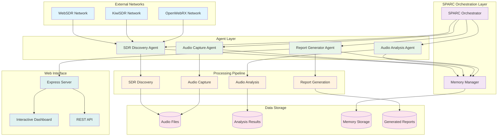
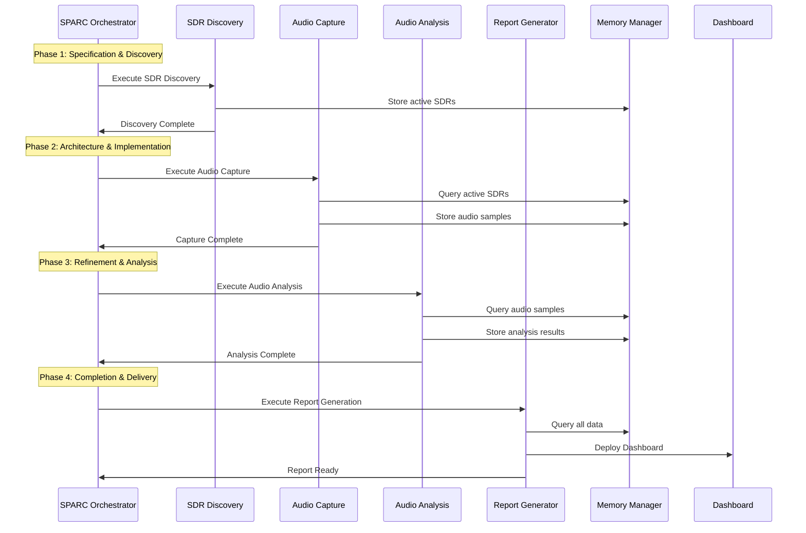
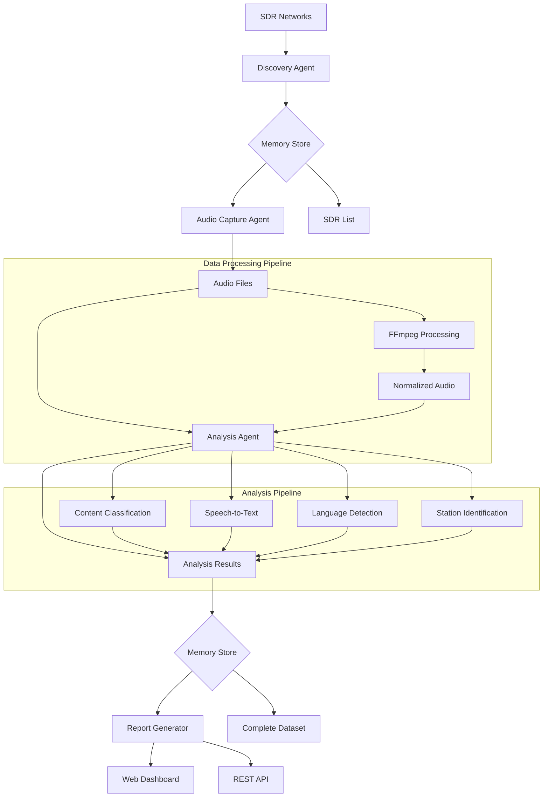
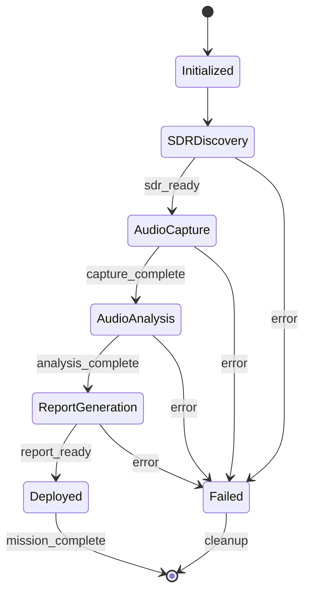

# 📡 Shortwave Monitor System Architecture Overview

## System Architecture Overview

The Shortwave Monitor system is a comprehensive SPARC-based intelligence platform that automatically discovers WebSDR/KiwiSDR receivers, captures audio samples across HF frequencies, analyzes content using AI, and generates intelligence reports through an interactive web dashboard.

## 🏗️ High-Level Architecture



## 🔄 SPARC Methodology Flow



## 🔧 Component Architecture

### 1. SDR Discovery Agent
**Purpose**: Identifies and monitors WebSDR/KiwiSDR receivers
- **Input**: WebSDR/KiwiSDR network endpoints
- **Output**: List of active, scored SDR receivers
- **Key Features**:
  - Parallel network scanning
  - Quality scoring based on accessibility and response time
  - Geographic location mapping
  - Network type classification

### 2. Audio Capture Agent
**Purpose**: Captures audio samples from selected SDR receivers
- **Input**: Active SDR list from discovery phase
- **Output**: Audio files with metadata
- **Key Features**:
  - Multi-frequency band capture (HF voice, broadcast, CW/digital, utility)
  - Parallel capture across multiple SDRs
  - Audio processing with FFmpeg
  - Quality estimation and metadata generation

### 3. Audio Analysis Agent
**Purpose**: Processes captured audio for intelligence extraction
- **Input**: Audio files from capture phase
- **Output**: Analysis results with transcriptions and classifications
- **Key Features**:
  - Content type classification (voice, CW, digital, broadcast)
  - Speech-to-text transcription
  - Language detection
  - Station identification and callsign extraction
  - Confidence scoring

### 4. Report Generator Agent
**Purpose**: Creates intelligence reports and web dashboard
- **Input**: All analysis results and metadata
- **Output**: Interactive web dashboard
- **Key Features**:
  - Executive summary generation
  - Geographic coverage visualization
  - Content analysis charts
  - Audio sample playback interface
  - Real-time dashboard updates

### 5. Memory Manager
**Purpose**: Handles inter-agent communication and state persistence
- **Features**:
  - Namespaced memory storage
  - Signal-based coordination
  - Timeout handling for agent synchronization
  - JSON-based file storage

## 📊 Data Flow Architecture



## 🔐 Security Architecture

### Security Boundaries
1. **Network Layer**: Only accesses public WebSDR instances
2. **Data Layer**: No permanent storage of sensitive audio content
3. **Processing Layer**: Local-only analysis, no cloud dependencies
4. **Memory Layer**: Encrypted storage with namespace isolation

### Privacy Safeguards
- Audio samples are processed locally
- No personal information collection
- Temporary file cleanup after analysis
- Memory encryption for sensitive data

## 🚀 Performance Architecture

### Parallel Processing Design
- **Agent Coordination**: Multiple agents run concurrently using Promise.allSettled()
- **Memory Efficiency**: Streaming audio processing to minimize RAM usage
- **Network Optimization**: Intelligent SDR selection based on quality scores
- **Scalability**: Modular design allows for easy horizontal scaling

### Performance Metrics
- SDR Discovery: 10-30 seconds
- Audio Capture: 60 seconds per sample
- Analysis Processing: 5-15 seconds per sample
- Report Generation: 2-5 seconds
- **Total Workflow**: 3-5 minutes end-to-end

## 🔄 State Management



## 📈 Scalability Considerations

### Horizontal Scaling
- **Agent Distribution**: Agents can be deployed across multiple nodes
- **Load Balancing**: SDR discovery can be distributed geographically
- **Data Sharding**: Audio processing can be parallelized by frequency bands

### Vertical Scaling
- **Memory Optimization**: Configurable sample rates and durations
- **CPU Optimization**: Concurrent processing with worker threads
- **Storage Optimization**: Configurable retention policies

## 🛠️ Technology Stack

### Core Technologies
- **Runtime**: Node.js 18+ with ES Modules
- **Framework**: Express.js for web server
- **Audio Processing**: FFmpeg for audio manipulation
- **Data Storage**: JSON files with namespaced memory management
- **Web Technologies**: HTML5, CSS3, JavaScript for dashboard

### External Dependencies
- **node-fetch**: HTTP client for SDR network access
- **cheerio**: HTML parsing for SDR discovery
- **ws**: WebSocket support for real-time updates
- **express**: Web server framework

## 🔧 Configuration Management

### Environment Variables
```bash
PORT=3000                    # Dashboard port
SPARC_MEMORY_DIR=./data     # Memory storage location
AUDIO_SAMPLE_RATE=16000     # Audio sample rate
CAPTURE_DURATION=60         # Capture duration in seconds
DEBUG=sparc:*               # Debug logging
```

### Configuration Files
- **package.json**: Dependencies and scripts
- **CLAUDE.md**: SPARC development configuration
- **.roomodes**: SPARC mode definitions

## 📋 Quality Assurance

### Testing Strategy
- **Unit Tests**: Individual agent functionality
- **Integration Tests**: Agent coordination and memory operations
- **End-to-End Tests**: Complete workflow validation
- **Performance Tests**: Load testing and resource monitoring

### Monitoring & Observability
- **Execution Logging**: Detailed progress tracking
- **Performance Metrics**: Timing and resource usage
- **Error Handling**: Comprehensive error capture and recovery
- **Health Checks**: System status monitoring

This architecture provides a robust, scalable, and secure foundation for the Shortwave Monitor system, following SPARC methodology principles while ensuring high performance and reliability.