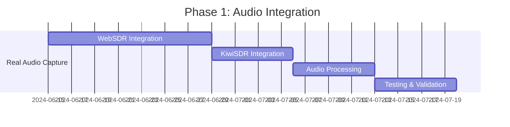
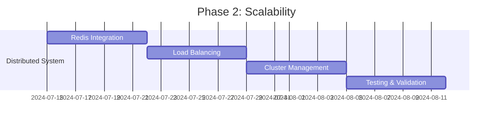
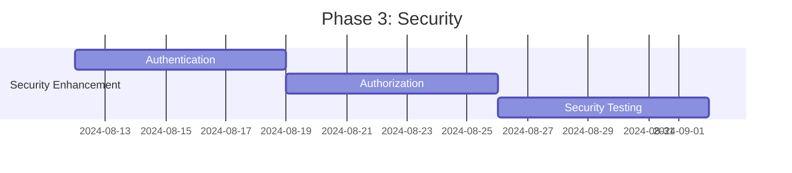

# 📋 Shortwave Monitor Implementation Plan

## Implementation Overview

This document outlines a comprehensive implementation plan for enhancing the Shortwave Monitor system based on architectural analysis. The plan follows SPARC methodology with phased development, clear milestones, and optimization opportunities.

## 🎯 Current System Assessment

### Strengths
✅ **Solid SPARC Foundation**: Well-implemented orchestration pattern
✅ **Modular Architecture**: Clear separation of concerns across agents
✅ **Memory Management**: Effective inter-agent communication system
✅ **Web Dashboard**: Functional reporting interface
✅ **Health Monitoring**: Basic health check implementation
✅ **Comprehensive Documentation**: Well-documented APIs and architecture

### Areas for Improvement
⚠️ **Audio Processing**: Simulated audio capture needs real WebSDR integration
⚠️ **Analysis Accuracy**: Mock analysis functions need AI/ML implementation
⚠️ **Scalability**: Single-node architecture limits throughput
⚠️ **Security**: Basic security model needs enhancement
⚠️ **Performance**: Potential optimizations for high-volume processing
⚠️ **Testing**: Limited test coverage for complex workflows

## 🚀 Implementation Phases

### Phase 1: Core Functionality Enhancement (4-6 weeks)

#### 1.1 Real Audio Integration
**Priority**: High | **Effort**: Large | **Risk**: Medium



**Implementation Tasks**:
- Replace simulated audio capture with real WebSDR WebSocket integration
- Implement KiwiSDR API integration for live audio streaming
- Add audio format conversion and quality validation
- Implement proper error handling for network audio streams

**SPARC Mode Assignment**:
```bash
npx claude-flow sparc run code "Implement WebSDR WebSocket audio capture"
npx claude-flow sparc run tdd "Create audio capture integration tests"
```

#### 1.2 AI-Powered Analysis
**Priority**: High | **Effort**: Large | **Risk**: High

**Implementation Tasks**:
- Integrate speech-to-text service (e.g., Whisper API, Google Speech-to-Text)
- Implement CW/Morse code decoder using DSP algorithms
- Add digital mode detection (PSK31, FT8, RTTY)
- Develop language detection using ML models
- Create station identification database and matching system

**SPARC Mode Assignment**:
```bash
npx claude-flow sparc run architect "Design AI analysis pipeline architecture"
npx claude-flow sparc run code "Implement speech-to-text integration"
npx claude-flow sparc run tdd "Create analysis accuracy tests"
```

#### 1.3 Performance Optimization
**Priority**: Medium | **Effort**: Medium | **Risk**: Low

**Implementation Tasks**:
- Implement audio streaming and chunked processing
- Add concurrent audio capture across multiple SDRs
- Optimize memory usage for large audio files
- Implement audio compression and storage optimization

### Phase 2: Scalability & Reliability (3-4 weeks)

#### 2.1 Distributed Architecture
**Priority**: Medium | **Effort**: Large | **Risk**: Medium



**Implementation Tasks**:
- Replace file-based memory with Redis cluster
- Implement horizontal scaling for agents
- Add load balancing for SDR discovery and capture
- Create distributed coordination mechanisms

**SPARC Mode Assignment**:
```bash
npx claude-flow sparc run architect "Design distributed system architecture"
npx claude-flow sparc run devops "Implement Redis cluster setup"
npx claude-flow sparc run integration "Test distributed agent coordination"
```

#### 2.2 Enhanced Monitoring
**Priority**: Medium | **Effort**: Medium | **Risk**: Low

**Implementation Tasks**:
- Integrate Prometheus metrics collection
- Add Grafana dashboards for system monitoring
- Implement alerting for system failures
- Create performance benchmarking tools

### Phase 3: Security & Production Readiness (2-3 weeks)

#### 3.1 Security Implementation
**Priority**: High | **Effort**: Medium | **Risk**: Medium



**Implementation Tasks**:
- Implement JWT-based authentication
- Add role-based access control (RBAC)
- Enhance input validation and sanitization
- Add security headers and HTTPS support
- Implement audit logging

**SPARC Mode Assignment**:
```bash
npx claude-flow sparc run security-review "Implement authentication system"
npx claude-flow sparc run code "Add RBAC and authorization"
```

#### 3.2 Production Deployment
**Priority**: High | **Effort**: Medium | **Risk**: Low

**Implementation Tasks**:
- Create Docker containers and Kubernetes manifests
- Implement CI/CD pipelines
- Add automated testing and deployment
- Create production configuration management

### Phase 4: Advanced Features (3-4 weeks)

#### 4.1 Real-time Features
**Priority**: Low | **Effort**: Large | **Risk**: Medium

**Implementation Tasks**:
- Implement WebSocket for real-time dashboard updates
- Add live audio streaming to dashboard
- Create real-time frequency scanning
- Implement push notifications for significant events

**SPARC Mode Assignment**:
```bash
npx claude-flow sparc run architect "Design real-time system architecture"
npx claude-flow sparc run code "Implement WebSocket integration"
```

#### 4.2 Intelligence Enhancement
**Priority**: Low | **Effort**: Large | **Risk**: High

**Implementation Tasks**:
- Add geolocation analysis for transmission sources
- Implement trend analysis and pattern recognition
- Create automated report generation with insights
- Add historical data analysis capabilities

## 🔧 Technical Improvements

### High-Priority Improvements

#### 1. WebSDR Integration Enhancement
```typescript
// Replace simulated capture with real WebSDR integration
class RealWebSDRCapture {
  async captureFromWebSDR(sdr: SDRResult, config: CaptureConfig): Promise<AudioBuffer> {
    const ws = new WebSocket(`${sdr.url}/ws`);
    
    // Set frequency and mode
    await this.setFrequency(ws, config.frequency);
    await this.setMode(ws, config.mode);
    
    // Capture audio stream
    const audioData = await this.captureAudioStream(ws, config.duration);
    
    return this.processAudioData(audioData);
  }
}
```

#### 2. Real Analysis Implementation
```typescript
// Replace mock analysis with real ML/AI integration
class RealAudioAnalysis {
  async analyzeAudio(audioBuffer: AudioBuffer): Promise<AnalysisResult> {
    const analysis = {
      contentType: await this.classifyContent(audioBuffer),
      transcription: await this.speechToText(audioBuffer),
      language: await this.detectLanguage(audioBuffer),
      stations: await this.extractStations(audioBuffer)
    };
    
    return this.calculateConfidence(analysis);
  }
  
  private async speechToText(audio: AudioBuffer): Promise<string> {
    // Integration with Whisper API or similar
    const response = await fetch('https://api.openai.com/v1/audio/transcriptions', {
      method: 'POST',
      headers: {
        'Authorization': `Bearer ${process.env.OPENAI_API_KEY}`,
        'Content-Type': 'multipart/form-data'
      },
      body: this.formatAudioForAPI(audio)
    });
    
    return response.json().text;
  }
}
```

#### 3. Performance Optimization
```typescript
// Implement streaming and concurrent processing
class OptimizedOrchestrator extends SPARCOrchestrator {
  async executePhase2(): Promise<void> {
    const sdrs = await this.memory.query('active_sdrs');
    
    // Parallel capture across multiple SDRs with streaming
    const captureStreams = sdrs.map(sdr => 
      this.streamingCapture(sdr)
    );
    
    // Process audio in real-time as it's captured
    const analysisPromises = captureStreams.map(stream =>
      this.streamingAnalysis(stream)
    );
    
    await Promise.allSettled(analysisPromises);
  }
  
  private async streamingCapture(sdr: SDRResult): Promise<ReadableStream> {
    // Implement streaming audio capture
    return new ReadableStream({
      start(controller) {
        // WebSocket connection with streaming data
      }
    });
  }
}
```

### Medium-Priority Improvements

#### 4. Enhanced Error Handling
```typescript
class RobustErrorHandler {
  async executeWithRetry<T>(
    operation: () => Promise<T>,
    maxRetries: number = 3,
    backoffMs: number = 1000
  ): Promise<T> {
    for (let attempt = 1; attempt <= maxRetries; attempt++) {
      try {
        return await operation();
      } catch (error) {
        if (attempt === maxRetries) throw error;
        
        console.log(`Attempt ${attempt} failed, retrying in ${backoffMs}ms...`);
        await new Promise(resolve => setTimeout(resolve, backoffMs));
        backoffMs *= 2; // Exponential backoff
      }
    }
  }
}
```

#### 5. Configuration Management
```typescript
interface SystemConfig {
  audio: {
    sampleRate: number;
    duration: number;
    maxConcurrentCaptures: number;
  };
  analysis: {
    speechToTextProvider: 'whisper' | 'google' | 'azure';
    confidenceThreshold: number;
    enableRealTimeProcessing: boolean;
  };
  performance: {
    maxMemoryUsage: number;
    cleanupInterval: number;
    streamingEnabled: boolean;
  };
}

class ConfigManager {
  static load(): SystemConfig {
    return {
      audio: {
        sampleRate: parseInt(process.env.AUDIO_SAMPLE_RATE || '16000'),
        duration: parseInt(process.env.CAPTURE_DURATION || '60'),
        maxConcurrentCaptures: parseInt(process.env.MAX_CONCURRENT_CAPTURES || '5')
      },
      // ... other config sections
    };
  }
}
```

## 📊 Performance Optimization Strategy

### Memory Optimization
```typescript
class MemoryOptimizer {
  private readonly maxMemoryUsage = 512 * 1024 * 1024; // 512MB
  
  async optimizeMemoryUsage(): Promise<void> {
    const currentUsage = process.memoryUsage().heapUsed;
    
    if (currentUsage > this.maxMemoryUsage) {
      // Trigger garbage collection
      if (global.gc) global.gc();
      
      // Clean up old audio files
      await this.cleanupOldAudioFiles();
      
      // Compact memory storage
      await this.compactMemoryStorage();
    }
  }
  
  private async cleanupOldAudioFiles(): Promise<void> {
    const audioDir = path.join(process.cwd(), 'data', 'audio');
    const files = await fs.readdir(audioDir);
    const now = Date.now();
    
    for (const file of files) {
      const filePath = path.join(audioDir, file);
      const stats = await fs.stat(filePath);
      
      // Delete files older than 1 hour
      if (now - stats.mtime.getTime() > 3600000) {
        await fs.unlink(filePath);
      }
    }
  }
}
```

### Network Optimization
```typescript
class NetworkOptimizer {
  private connectionPool = new Map<string, WebSocket>();
  
  async getOptimizedConnection(sdrUrl: string): Promise<WebSocket> {
    if (this.connectionPool.has(sdrUrl)) {
      const existing = this.connectionPool.get(sdrUrl);
      if (existing.readyState === WebSocket.OPEN) {
        return existing;
      }
    }
    
    const ws = new WebSocket(sdrUrl);
    this.connectionPool.set(sdrUrl, ws);
    
    // Setup connection recycling
    setTimeout(() => {
      if (ws.readyState === WebSocket.OPEN) {
        ws.close();
      }
      this.connectionPool.delete(sdrUrl);
    }, 300000); // 5 minutes
    
    return ws;
  }
}
```

## 🧪 Testing Strategy

### Unit Testing Enhancement
```typescript
// Enhanced test coverage for all components
describe('AudioCaptureAgent', () => {
  test('should capture real audio from WebSDR', async () => {
    const agent = new AudioCaptureAgent();
    const mockSDR = {
      url: 'ws://test-websdr.example.com',
      location: 'Test Location'
    };
    
    const audioSample = await agent.captureFrequency(mockSDR, {
      frequency: 14250000,
      mode: 'usb',
      duration: 10
    });
    
    expect(audioSample).toBeDefined();
    expect(audioSample.metadata.duration).toBe(10);
  });
});
```

### Integration Testing
```typescript
describe('SPARC Workflow Integration', () => {
  test('should complete full workflow with real data', async () => {
    const orchestrator = new SPARCOrchestrator();
    
    // Mock external dependencies
    jest.mock('./agents/sdr-discovery.js');
    
    const result = await orchestrator.execute();
    
    expect(result.status).toBe('MISSION_COMPLETED');
    expect(result.summary.sdrs_discovered).toBeGreaterThan(0);
  });
});
```

## 📈 Success Metrics

### Performance Targets
- **SDR Discovery**: < 30 seconds for 100+ SDRs
- **Audio Capture**: 99% success rate with < 5% data loss
- **Analysis Accuracy**: > 85% confidence for voice transcription
- **System Uptime**: 99.9% availability
- **Memory Usage**: < 1GB under normal load
- **Response Time**: < 2 seconds for dashboard updates

### Quality Metrics
- **Test Coverage**: > 90% code coverage
- **Documentation**: 100% API documentation coverage
- **Security**: Zero critical vulnerabilities
- **Performance**: < 100ms average API response time

## 🚀 Deployment Strategy

### Development Deployment
```bash
# Local development with hot reload
npm run dev

# Run with specific SPARC mode
npx claude-flow sparc run tdd "implement new feature"
```

### Production Deployment
```bash
# Docker deployment
docker-compose up -d

# Kubernetes deployment
kubectl apply -f k8s/

# Monitor deployment
kubectl get pods -n shortwave-monitor
```

## 📋 Implementation Checklist

### Phase 1 Tasks
- [ ] Implement WebSDR WebSocket integration
- [ ] Add KiwiSDR API support
- [ ] Integrate real speech-to-text service
- [ ] Implement CW decoder
- [ ] Add digital mode detection
- [ ] Create comprehensive test suite
- [ ] Performance optimization implementation
- [ ] Documentation updates

### Phase 2 Tasks
- [ ] Redis cluster integration
- [ ] Horizontal scaling implementation
- [ ] Load balancing setup
- [ ] Prometheus monitoring integration
- [ ] Grafana dashboard creation
- [ ] Alerting system setup

### Phase 3 Tasks
- [ ] JWT authentication implementation
- [ ] RBAC system creation
- [ ] Security hardening
- [ ] HTTPS and security headers
- [ ] Audit logging implementation
- [ ] Docker container optimization
- [ ] Kubernetes manifests
- [ ] CI/CD pipeline setup

### Phase 4 Tasks
- [ ] WebSocket real-time updates
- [ ] Live audio streaming
- [ ] Geolocation analysis
- [ ] Trend analysis implementation
- [ ] Historical data analysis
- [ ] Advanced reporting features

## 🎯 Next Steps

1. **Immediate Actions** (Next Sprint):
   - Start Phase 1.1: Real Audio Integration
   - Set up development environment for WebSDR testing
   - Begin speech-to-text API integration planning

2. **Medium-term Goals** (Next Month):
   - Complete core functionality enhancement
   - Implement basic scalability features
   - Begin security implementation

3. **Long-term Vision** (3-6 Months):
   - Full production deployment
   - Advanced AI features
   - Global SDR network coverage

This implementation plan provides a comprehensive roadmap for transforming the Shortwave Monitor from a proof-of-concept to a production-ready intelligence system following SPARC methodology principles.